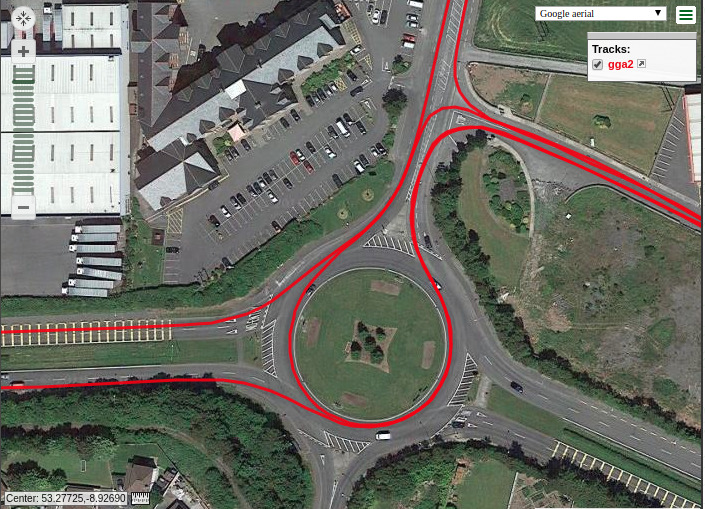

# GNSS_RTK_data

I've found getting uBlox M8P modules to operate in RTK mode very straigtforward. But getting post-processsed
RTK using RTKlib frustratingly difficult (so far). I searched for some example data files and
found very little. To help others doing similar experiments I've made available some of my datasets and processing scripts
available here.

* [20181108](./20181108) Rover mounted on roof of car. 
